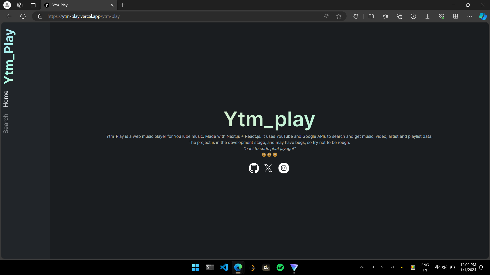
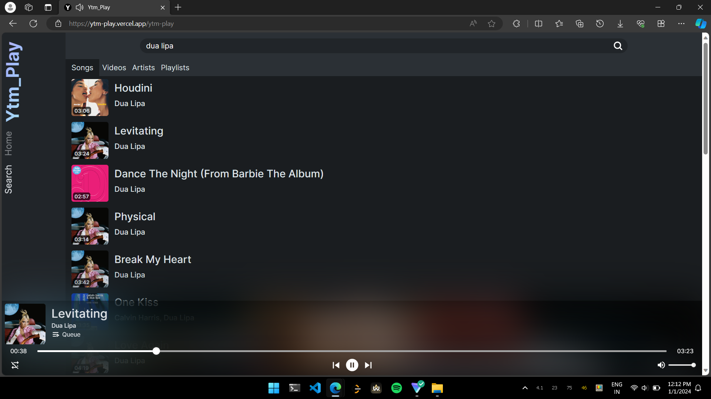
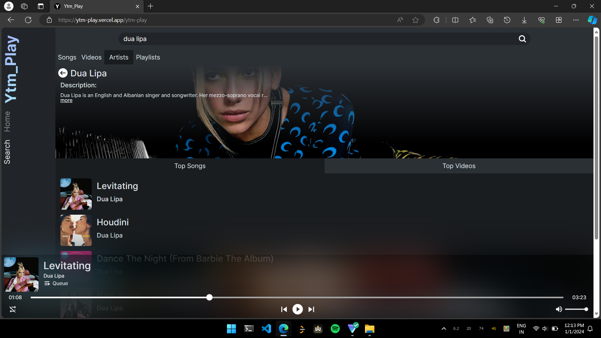
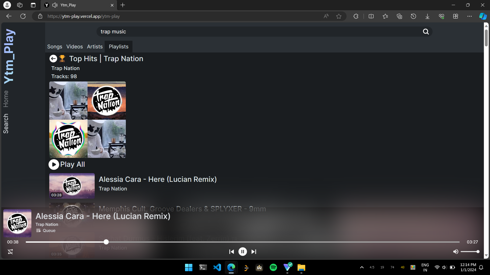
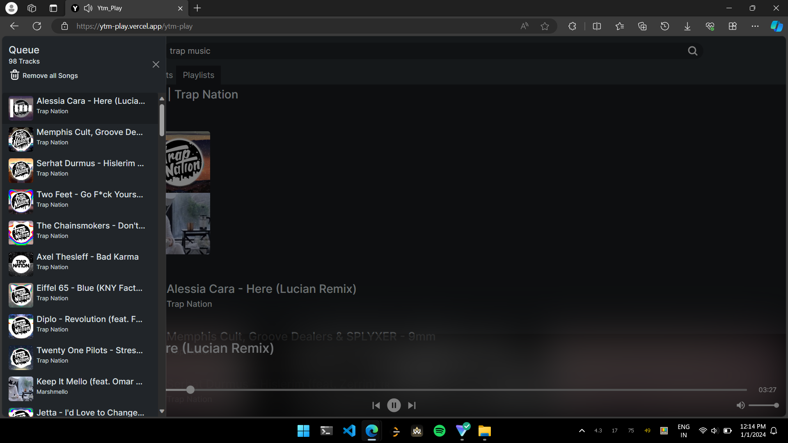

# Ytm-Play
Ytm_Play is a web music player for YouTube music. Made with Next.js + React.js. It uses YouTube and Google APIs to search and get music, video, artist and playlist data.\
live at: [here](https://ytm-play.vercel.app/ytm-play)
 

